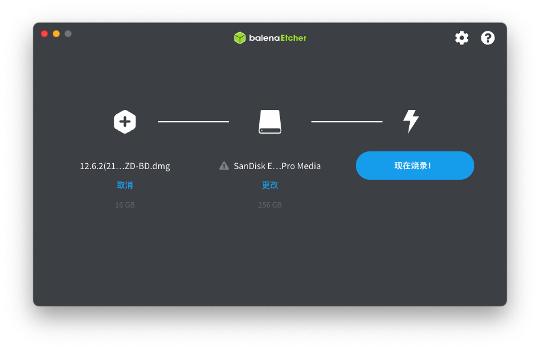

## 　Lenovo xiaoxin 14 pro 2020 黑苹果

| 名称         | 型号                        | 状态   |
| ------------ |---------------------------|------|
| 机型         | Lenovo xiaoxin 14 pro 2020 |      |
| CPU          | AMD Ryzen™ 7 5800H        | 可用   |
| 核显         | AMD Radeon Graphics       | 可用   |
| 网卡         | AX200                     | 免驱网卡 |
| 固态         | SN750 512G(原装的海力士和黑苹果不兼容) | 可用   |
| 键盘、触控板 |                           | 可用   |
| 声卡、音频   | Realtek ALC287         | 可用   |
| 麦克风   | Realtek ALC287(定制)        | 可用   |
| 电池         |                           | 正常   |
| 蓝牙         |                           | 可用   |
| 睡眠         |                           | 正常   |
| 随航         |                           | 可用   |
| 隔空投送       |                           | 可用   |
| 内存         | 三星16G x2                  | 可用   |
| USB          |                           | 可用   |
| HDMI          |                           | 未测试  |

### 1 制作启动盘

#### 1.1 刷写macOS安装镜像

使用 [etcher](https://github.com/balena-io/etcher) 把 macOS镜像 写入U盘

#### 1.2 制作启动分区

使用 [diskgenius](https://www.diskgenius.cn) 划分一个 OpenCore 分区(建议最少300m)，格式化为FAT32。

把的EFI解压到 OpenCore 分区。(也可以先在U盘做一个 OpenCore 分区，装完系统后记得移动)

#### 1.3 划分 macOS 安装分区

划分一个分区留作 **macOS的系统分区**，格式随意，大小自己把握。我划分了1T

### 2 安装黑苹果

#### 2.1 禁用核显驱动

使用 [OCAuxiliaryTools](https://github.com/ic005k/OCAuxiliaryTools) 禁用核显，保存。 (每次安装或升级系统都需要禁用)

#### 2.2 关闭安全启动

重启按 F2 进入BIOS

<u>Security</u> > <u>Secure Boot</u>

#### 2.3 开始安装

重启选择启动项 OpenCore

##### 2.3.1 EB错误

这个错误多重启几次就好了，我目前没有解决方法

#### 2.4 抹掉分区

进入安装系统后点击 **磁盘工具** 抹掉刚刚给 macOS 划分的分区 ，格式选择 **APFS**

(这个图片是我随便找的虚拟机安装截图，不过操作都是一样的)

开始安装，分区选择**刚刚抹掉的分区**，安装完成后配置好用户进入桌面

#### 2.5 进入系统

重启进入 pe 或 windows 使用 [OCAuxiliaryTools](https://github.com/ic005k/OCAuxiliaryTools) 启用核显，保存。

再次重启进入 OpenCore 引导，Reset NVRAM 进入macOS (每次修改配置后都要记得Reset NVRAM)

### 3 修改核显的显存

**==解锁修改显存并没有明显提升，并存在一定风险==**

需要使用 [Unlocker.exe](https://winraid.level1techs.com/t/tool-lenovo-h20-bios-unlocker-and-locker/38150) 解锁BIOS的高级选项

##### 3.5 设置核显显存

按照以下路径与图片设置核显显存（核显似乎对显存的设置有1G的限制）：

<u>AMD CBS</u> > <u>NBIO Common Options</u> > <u>GFX Configuration</u>
